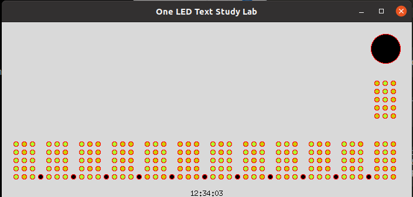

# One LED text study Lab
This is a simple simulator to test a new idea, in a text interface with one simple LED.

## Description.
This is a program to study and simulate a new idea that I had for a simple way to encode text in a one LED interface. It doesn't require any remembering of a translation table, like Morse Code, because it is a simple mapping. But it is less efficient then Morse Code. It uses 3 levels for the LED, 1 - OFF, 2 - Medium amplitude (PWM or resistor) and 3 - Full amplitude. The timing of the sequence can be easily adjusted in the code for a complete simulation study of the timings and of the method. Each character is composed by 3 columns of 5 rows each, the display in the LED is made by a scan of the character vertically, from the top to the bottom, one column at at a time. Top to bottom, left to right. And any different order can be easily achieved with a small modification to the code.  
In the scan line of the char, it starts LED OFF then if the first pixel of the character is ON it shows yellow FULL ON and it it's is OFF the LED shows Middle amplitude yellow (with some green for better visualization). Then a fast period of separation of LED OFF and then the next pixel is processed. Then when it terminates a column a some what bigger pause of LED OFF, then it start on the next column. When it end the character it will make a bigger LED OFF pause.  
The full alphabet, the full numerics, the principal math operations, and some language signs are mapped to this schema of characters.  
The idea is to study the multiple variations in the simulator and implement the best one in a micro-controller Arduino, ESP32 IDF, or any ARM micro. 
One possible application is for easily and cheaply have a one led printf() method for debugging in micro-controllers that are already deployed.  
I would like to remember you that one doesn't need to remember a mapping table, it's a simple normal character that will be rendered.

## Screen shoot

The real application is is animated.  
 

## License
MIT Open Source license

## Have fun!
Best regards,  
João Nuno Carvalho